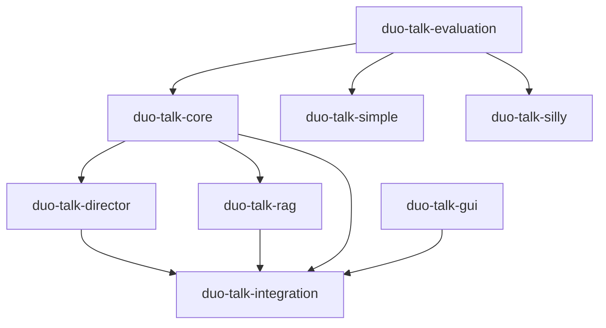

# duo-talk マイクロサービス化 詳細設計書

**作成日**: 2026-01-21  
**バージョン**: 2.0  
**目的**: 既存duo-talkプロジェクト群の複雑性を整理し、評価可能な構造に再設計

---

## 1. 背景と現状分析

### 1.1 現在の問題

| 問題 | 影響 | 原因 |
|------|------|------|
| **何が効いているか不明** | 改善方向が定まらない | モノリシック構造で機能が混在 |
| **再現性がない** | A/Bテストができない | 実行のたびに結果が変わる |
| **比較が困難** | 3プロジェクトの差が分からない | 統一された評価手法がない |
| **複雑性の増大** | メンテナンス困難 | GUI、Director、RAG等が密結合 |

### 1.2 既存プロジェクトの実態

#### duo-talk (メイン)
```
構成: React/TypeScript GUI + Flask backend
特徴: 
  - Director機能（効果不明）
  - ChromaDB（RAG）
  - 3つの実行パス（RUNS/LIVE/Console）
評価: 最も成功している（主観）
課題: 何が効いているか特定できない
```

#### duo-talk-simple
```
構成: CLI特化
特徴: シンプル化を意図
評価: 期待より性能が出ず
課題: なぜシンプル化で性能が落ちたか不明
```

#### duo-talk-silly
```
構成: KoboldCPP + SillyTavern
特徴: 
  - Gemma2 Swallow 27B
  - Character Card V2
  - TTS統合
評価: 技術検証用
課題: 他プロジェクトとの定量比較なし
```

---

## 2. 設計方針

### 2.1 コアプリンシプル

1. **測定可能性第一**
   - 全ての判断は測定結果に基づく
   - 「なんとなく良い」を排除

2. **機能の独立性**
   - 各機能を独立したサービスとして分離
   - ON/OFF切り替えで効果を測定

3. **再現性の確保**
   - 同じ入力 → 同じ出力
   - 実験結果の保存と追跡

4. **段階的移行**
   - 既存プロジェクトは保持
   - 新規プロジェクトで検証
   - 成功したら統合

### 2.2 マイクロサービス化の範囲

```
【分離する機能】
✓ キャラクター対話生成（コア）
✓ Director（会話制御）
✓ RAG/メモリ
✓ 評価システム
✓ GUI（フロントエンド）

【分離しないもの】
× VLM（Florence-2） - 現在未使用
× JetRacer連携 - 対話実験に無関係
```

---

## 3. 全体アーキテクチャ

### 3.1 システム構成図

```
duo-talk-ecosystem/
│
├── duo-talk-evaluation/        # 評価ツール（Phase 0 - 現在実装中）
│   └── 目的: 既存3プロジェクトの定量評価
│
├── duo-talk-core/              # Phase 1: 最小キャラクター対話
│   └── 目的: 純粋な対話性能のベースライン確立
│
├── duo-talk-director/          # Phase 2: Director機能（独立サービス）
│   └── 目的: Director有無での性能差測定
│
├── duo-talk-rag/               # Phase 3: RAG/メモリ（独立サービス）
│   └── 目的: RAG有無での性能差測定
│
├── duo-talk-gui/               # Phase 4: フロントエンド（独立）
│   └── 目的: 結果可視化とデモ
│
└── duo-talk-integration/       # Phase 5: 統合システム
    └── 目的: 最適構成の統合版
```

### 3.2 依存関係マップ



**依存の読み方**:
- evaluation → 既存3プロジェクトを評価
- core → Director, RAGの土台
- Director, RAG → coreに機能追加
- integration → 最適構成の統合
- GUI → 結果の可視化

---

## 4. Phase別詳細設計

### Phase 0: 評価基盤（現在進行中）

#### 目的
既存3プロジェクトの対話品質を定量評価

#### スコープ
```
duo-talk-evaluation/
├── src/evaluation/
│   ├── metrics.py              # 5つのメトリクス定義
│   ├── evaluator.py            # 評価器（Gemini/Local LLM）
│   └── adapters/               # 各プロジェクトへの接続
│       ├── duo_talk_adapter.py
│       ├── duo_talk_simple_adapter.py
│       └── duo_talk_silly_adapter.py
├── experiments/
│   └── compare_systems.py      # 3プロジェクト比較実験
└── results/
    ├── YYYY-MM-DD_comparison.json
    └── YYYY-MM-DD_comparison.md
```

#### 成果物
1. **比較レポート**
   - 3プロジェクトの定量スコア
   - どのメトリクスで差があるか
   - 「なぜduo-talkが良いのか」の仮説

2. **評価ツール**
   - 再利用可能な評価システム
   - 今後の全Phaseで使用

#### 設計上の決定事項

##### Q1: 各プロジェクトからどう会話を取得するか？

**オプションA: API経由**
```
前提: 各プロジェクトがHTTP APIを提供
方法: POST /generate でターン生成
利点: クリーン、制御しやすい
欠点: API実装が必要
```

**オプションB: CLI経由**
```
前提: コマンドラインで実行可能
方法: subprocess で呼び出し
利点: 既存のまま使える
欠点: 出力パースが必要
```

**オプションC: ライブラリインポート**
```
前提: Pythonモジュールとして利用可能
方法: from duo_talk import generate_dialogue
利点: 最速、直接制御
欠点: 依存関係の競合リスク
```

**推奨**: まずB（CLI）で実装、後でAに移行

##### Q2: 評価シナリオはどう設計するか？

**シナリオ設計**:
```yaml
scenarios:
  - name: "casual_greeting"
    initial_prompt: "おはよう、二人とも"
    turns: 5
    評価観点: character_consistency, naturalness
    
  - name: "topic_exploration"
    initial_prompt: "最近のAI技術について話して"
    turns: 8
    評価観点: topic_novelty, concreteness
    
  - name: "disagreement_resolution"
    initial_prompt: "直感とデータ、どっちが大事？"
    turns: 10
    評価観点: relationship_quality, naturalness
    
  - name: "emotional_support"
    initial_prompt: "最近疲れてるんだ..."
    turns: 6
    評価観点: relationship_quality, naturalness
```

##### Q3: 評価バックエンドはどれを使うか？

**決定**: ローカルLLM（KoboldCPP）を優先
- Gemini APIはクォータ制限が厳しい
- KoboldCPP（Gemma2 Swallow）は無制限
- 日本語性能も同時に検証できる

---

### Phase 1: duo-talk-core 抽出

#### 目的
純粋なキャラクター対話機能のみを抽出し、ベースライン性能を確立

#### スコープ
```
duo-talk-core/
├── src/
│   ├── character.py            # キャラクターロジック
│   ├── llm_client.py           # LLM API抽象化
│   ├── prompt_engine.py        # プロンプト生成
│   └── dialogue_manager.py     # ターン管理
├── config/
│   ├── yana.yaml               # やな設定（既存からコピー）
│   ├── ayu.yaml                # あゆ設定（既存からコピー）
│   └── llm_backend.yaml        # LLMバックエンド設定
├── tests/
│   └── test_dialogue.py
└── examples/
    └── simple_dialogue.py      # 使用例
```

#### 設計方針

##### コンポーネント独立性
```python
# 各コンポーネントは独立動作可能
llm_client = LLMClient(backend="ollama", model="gemma3:12b")
prompt_engine = PromptEngine()
character_yana = Character.from_file("config/yana.yaml")

# 外部依存なし（Director, RAG, GUI無し）
dialogue = character_yana.generate_response(
    user_input="おはよう",
    context=current_context
)
```

##### 設定ファイル駆動
```yaml
# config/yana.yaml
character:
  name: やな
  role: 姉
  first_person: 私
  personality:
    - 直感的
    - 行動派
  speech_patterns:
    endings: ["〜わ", "〜かしら"]

# 既存duo-talkのpersona/から移植
# 新規作成はしない
```

#### 成果物
1. **ベースライン性能**
   - Director無し、RAG無しのスコア
   - 「最小構成でどこまでいけるか」の基準

2. **再利用可能なコア**
   - Phase 2以降の土台
   - 他プロジェクトへの組み込み可能

#### 設計上の決定事項

##### Q1: 既存duo-talkから何を抽出するか？

**抽出するもの**:
- キャラクター定義ファイル（persona/*.yaml）
- プロンプト生成ロジック
- LLM API呼び出し部分

**抽出しないもの**:
- GUI関連（React/Flask）
- Director機能
- ChromaDB統合
- 実行パス制御（RUNS/LIVE）

**実装方法**:
1. 既存duo-talkのコードを参照
2. 最小限のコードを新規作成
3. 設定ファイルはコピー（改変なし）

##### Q2: LLMバックエンドの選択は？

**サポートするバックエンド**:
```yaml
backends:
  ollama:
    base_url: "http://localhost:11434"
    models: ["gemma3:12b", "cydonia-22b"]
  
  koboldcpp:
    base_url: "http://localhost:5001"
    models: ["gemma2-swallow-27b"]
  
  vllm:
    base_url: "http://localhost:8000"
    models: ["gemma-3-12b-it-quantized"]
```

**切り替え方法**: 環境変数またはconfig/llm_backend.yaml

---

### Phase 2: duo-talk-director 分離

#### 目的
Director機能を独立サービス化し、有無での性能差を測定

#### スコープ
```
duo-talk-director/
├── src/
│   ├── director.py             # Director本体
│   ├── rules.py                # 介入ルール
│   └── api.py                  # HTTP API (FastAPI)
├── config/
│   └── rules.yaml              # 介入ルール設定
├── tests/
│   └── test_director.py
└── examples/
    └── director_client.py      # 使用例
```

#### アーキテクチャ

```
duo-talk-core                duo-talk-director
     ↓                              ↓
  会話生成        →      Director判定      →   介入が必要？
     ↓                              ↓
  応答返却        ←      修正指示/承認      ←   Yes/No
```

##### Director API設計
```python
# POST /check_intervention
Request:
{
    "conversation": [
        {"speaker": "やな", "content": "..."},
        {"speaker": "あゆ", "content": "..."}
    ],
    "signals": {
        "loop_detected": false,
        "silence_duration": 0,
        "last_speaker": "あゆ"
    }
}

Response (介入不要):
{
    "intervention_needed": false
}

Response (介入必要):
{
    "intervention_needed": true,
    "type": "loop_break",
    "instruction": "具体的な数値や場所を1つ出してください",
    "target_character": "やな"
}
```

#### 実験設計

##### A/Bテスト
```
実験A: Director OFF
  → duo-talk-core単体で会話生成
  → 評価スコア取得

実験B: Director ON
  → duo-talk-core + duo-talk-director
  → 評価スコア取得

比較:
  - 各メトリクスの差
  - 介入頻度と効果の相関
  - どの介入タイプが有効か
```

#### 成果物
1. **Director効果レポート**
   - Director有無でのスコア差
   - 有効な介入ルール
   - 不要な介入ルール

2. **設計知見**
   - Directorを入れるべきか
   - どのルールが本当に効くか

#### 設計上の決定事項

##### Q1: 介入ルールをどう定義するか？

**ルール例**:
```yaml
rules:
  loop_prevention:
    trigger:
      - same_topic_3turns: true
    action:
      type: "inject_instruction"
      instruction: "具体例を1つ出してください"
    priority: high
  
  silence_avoidance:
    trigger:
      - no_response_5sec: true
    action:
      type: "prompt_continuation"
      instruction: "現在の状況を説明してください"
    priority: medium
  
  character_consistency:
    trigger:
      - wrong_first_person: true
    action:
      type: "reject_response"
      instruction: "一人称を修正してください"
    priority: high
```

##### Q2: 介入頻度の制御は？

**問題**: 「毎ターン介入病」を防ぐ

**解決策**:
```python
class Director:
    def __init__(self):
        self.intervention_cooldown = 3  # 3ターンは介入しない
        self.last_intervention_turn = -999
        
    def should_intervene(self, current_turn):
        if current_turn - self.last_intervention_turn < self.intervention_cooldown:
            return False  # クールダウン中
        # その他の判定...
```

---

### Phase 3: duo-talk-rag 分離

#### 目的
RAG/メモリ機能を独立サービス化し、有無での性能差を測定

#### スコープ
```
duo-talk-rag/
├── src/
│   ├── memory_manager.py       # メモリ管理
│   ├── chromadb_client.py      # ChromaDB操作
│   └── api.py                  # HTTP API
├── config/
│   └── memory.yaml             # メモリ設定
├── tests/
│   └── test_rag.py
└── data/
    └── embeddings/             # ベクトルDB保存先
```

#### アーキテクチャ

```
duo-talk-core           duo-talk-rag
     ↓                       ↓
  ユーザー入力   →   関連記憶検索    →   類似記憶取得
     ↓                       ↓
  プロンプト生成  ←   記憶内容注入    ←   Top-K結果
     ↓
  LLM生成
```

##### RAG API設計
```python
# POST /search_memory
Request:
{
    "query": "最近のAI技術",
    "character": "やな",
    "top_k": 3
}

Response:
{
    "memories": [
        {
            "content": "強化学習について勉強した",
            "timestamp": "2026-01-20T10:00:00",
            "relevance_score": 0.89
        },
        ...
    ]
}

# POST /store_memory
Request:
{
    "content": "今日はTransformerについて学んだ",
    "character": "あゆ",
    "metadata": {
        "topic": "AI技術",
        "emotion": "excited"
    }
}
```

#### 実験設計

##### A/Bテスト
```
実験A: RAG OFF
  → 会話履歴のみで生成
  → 評価スコア

実験B: RAG ON
  → 過去の記憶も参照して生成
  → 評価スコア

比較:
  - 文脈の一貫性（topic_novelty逆説的に低下？）
  - 具体性の向上（concreteness向上？）
  - 「初耳問題」の発生率
```

#### 成果物
1. **RAG効果レポート**
   - RAG有無でのスコア差
   - どのメトリクスに効くか
   - 記憶の鮮度と効果の関係

2. **設計知見**
   - RAGは本当に必要か
   - 検索件数（top_k）の最適値

#### 設計上の決定事項

##### Q1: 記憶の粒度は？

**オプション**:
- ターン単位: 1応答 = 1記憶
- 会話単位: 1セッション = 1記憶
- トピック単位: 1話題 = 1記憶

**推奨**: トピック単位（要約して保存）

##### Q2: 記憶の保存タイミングは？

**問題**: リアルタイム書き込みはVRAM圧迫

**解決策**:
```python
class MemoryManager:
    def __init__(self):
        self.write_buffer = []
        
    def buffer_memory(self, memory):
        """走行中はバッファに溜める"""
        self.write_buffer.append(memory)
        
    def flush_to_db(self):
        """走行後にまとめて書き込み"""
        for memory in self.write_buffer:
            self.db.add(memory)
        self.write_buffer.clear()
```

---

### Phase 4: duo-talk-gui 分離

#### 目的
結果可視化とデモ用フロントエンド

#### スコープ
```
duo-talk-gui/
├── frontend/                   # React/TypeScript
│   ├── src/
│   │   ├── components/
│   │   │   ├── ChatWindow.tsx
│   │   │   ├── MetricsDisplay.tsx
│   │   │   └── ComparisonView.tsx
│   │   └── api/
│   │       └── client.ts
│   └── package.json
├── backend/                    # FastAPI
│   └── api.py
└── docker-compose.yml
```

#### 機能要件

##### 基本機能
1. **リアルタイム対話**
   - やな・あゆとチャット
   - 応答のストリーミング表示

2. **評価結果表示**
   - 5つのメトリクス可視化（レーダーチャート）
   - ターンごとのスコア推移

3. **比較ビュー**
   - 3プロジェクトの並列表示
   - スコア差のハイライト

##### 非機能要件
- レスポンス: 2秒以内
- 対応ブラウザ: Chrome/Firefox最新版
- モバイル対応: 不要（PC専用）

#### 優先度
**Priority: Low**（Phase 5後でも可）

理由:
- 評価実験にGUIは不要
- ターミナル + Markdownレポートで十分
- リソースを実験に集中すべき

---

### Phase 5: duo-talk-integration 統合

#### 目的
Phase 0-4の結果に基づき、最適構成を統合

#### 前提条件
```
Phase 0完了: どのプロジェクトが良いか判明
Phase 1完了: ベースライン性能確立
Phase 2完了: Director効果測定済み
Phase 3完了: RAG効果測定済み
```

#### 統合方針

##### シナリオA: Directorが有効、RAGも有効
```
duo-talk-integration/
├── docker-compose.yml
│   ├── core (ベース)
│   ├── director (有効)
│   ├── rag (有効)
│   └── gui (オプション)
└── config/
    └── optimal.yaml            # 最適パラメータ
```

##### シナリオB: Directorのみ有効
```
統合内容:
  - core + director
  - RAGは無効（効果なしと判明）
```

##### シナリオC: 全て無効（coreのみが最適）
```
統合内容:
  - duo-talk-core がそのまま最終形
  - Director, RAGは削除
```

**重要**: 実験結果が決定する（予断を持たない）

---

## 5. データフロー設計

### 5.1 評価実験のデータフロー

```
1. シナリオ定義
   ↓
2. SystemAdapter
   - 各プロジェクトに初期プロンプト送信
   - N ターン会話生成
   ↓
3. 会話ログ保存 (JSON)
   ↓
4. Evaluator
   - ローカルLLM または Gemini
   - 5つのメトリクス算出
   ↓
5. 結果保存 (JSON)
   ↓
6. レポート生成 (Markdown)
```

### 5.2 マイクロサービス間通信

```
[duo-talk-core]
    ↓ HTTP POST /generate
    ↓ {user_input, conversation_history}
    ↓
[duo-talk-director]
    ↓ HTTP POST /check
    ↓ {intervention_needed, instruction}
    ↓
[duo-talk-core]
    ↓ 修正または承認
    ↓ HTTP POST /search
[duo-talk-rag]
    ↓ {memories: [...]}
    ↓
[duo-talk-core]
    ↓ プロンプト生成 → LLM呼び出し
    ↓
[Response]
```

---

## 6. 実装優先順位とマイルストーン

### Week 1-2: Phase 0完成

```
タスク:
✓ LocalLLMEvaluator実装
✓ SystemAdapter実装（3プロジェクト）
✓ 比較実験実行
✓ レポート生成

成果物:
- comparison_report.md
- 「なぜduo-talkが良いのか」の仮説
```

### Week 3-4: Phase 1実装

```
タスク:
- duo-talk-core設計
- 既存duo-talkからコード抽出
- ベースライン評価

成果物:
- duo-talk-core (動作版)
- baseline_report.md
```

### Week 5-6: Phase 2実装

```
タスク:
- duo-talk-director分離
- A/Bテスト実施
- Director効果測定

成果物:
- director_effect_report.md
- 有効なルールリスト
```

### Week 7-8: Phase 3実装

```
タスク:
- duo-talk-rag分離
- A/Bテスト実施
- RAG効果測定

成果物:
- rag_effect_report.md
- 最適top_k値
```

### Week 9-10: Phase 5統合

```
タスク:
- 最適構成の統合
- 総合評価
- ドキュメント整備

成果物:
- duo-talk-integration
- 最終レポート
```

**Phase 4（GUI）は後回し**（実験に影響しない）

---

## 7. 技術選定

### 7.1 開発環境

| 項目 | 選定 | 理由 |
|------|------|------|
| 言語 | Python 3.12 | 既存プロジェクトと統一 |
| パッケージ管理 | conda | GPU環境との親和性 |
| テスト | pytest | TDD実装に適している |
| API | FastAPI | 軽量、型安全 |
| データ保存 | JSON + Markdown | 可読性と再利用性 |

### 7.2 LLMバックエンド

| バックエンド | 用途 | 優先度 |
|-------------|------|--------|
| KoboldCPP | 評価器、実験 | 最優先 |
| Ollama | 既存互換 | 中 |
| vLLM | 速度重視 | 低 |
| Gemini API | 評価器（補助） | 低 |

---

## 8. リスクと対策

### 8.1 技術リスク

| リスク | 影響 | 対策 |
|--------|------|------|
| SystemAdapter実装困難 | 評価実験ができない | まずCLI経由で実装、API化は後回し |
| LLM評価の精度不足 | 判断を誤る | 複数評価器で相互検証 |
| VRAM不足 | 実験できない | サービス順次起動、バッチ処理 |
| 既存コード解読困難 | 抽出に時間 | 必要最小限の新規実装も許容 |

### 8.2 プロジェクトリスク

| リスク | 影響 | 対策 |
|--------|------|------|
| スコープクリープ | 完成しない | Phase単位で明確な成果物 |
| 予期せぬ結果 | 計画変更 | 柔軟な設計、結果に基づく判断 |
| 工数超過 | 完成遅延 | Phase 4（GUI）は削除可能 |

---

## 9. 成功基準

### 9.1 Phase 0成功基準

- [ ] 3プロジェクトで同一シナリオ実行
- [ ] 5つのメトリクスで定量評価
- [ ] スコア差の統計的有意性確認
- [ ] 「なぜduo-talkが良いのか」の仮説3つ以上

### 9.2 Phase 1成功基準

- [ ] duo-talk-core単体動作
- [ ] 既存duo-talkとの評価スコア差±10%以内
- [ ] ベースライン性能の定量化

### 9.3 Phase 2/3成功基準

- [ ] Director/RAG有無でのスコア差測定
- [ ] 統計的有意性確認（t検定 p<0.05）
- [ ] 効果ありの判定基準明確化

### 9.4 最終成功基準

- [ ] 「何が効いているか」の定量的根拠
- [ ] 最適構成の実装
- [ ] 再現可能な評価手法の確立

---

## 10. Out of Scope（やらないこと）

### 10.1 技術的Scope外

- ❌ VLM（Florence-2）統合 - 現在未使用
- ❌ JetRacer連携 - 対話実験に無関係
- ❌ TTS/STT実装 - 評価に影響しない
- ❌ 新しいLLMモデルの学習 - 既存モデルで十分

### 10.2 機能的Scope外

- ❌ キャラクター定義の改善 - 既存を使用
- ❌ プロンプトエンジニアリング - 評価がメイン
- ❌ 新しいDirectorルール開発 - 効果測定が先
- ❌ RAG知識ベースの拡充 - 効果測定が先

### 10.3 優先度低（後回し）

- 🔽 GUI実装 - ターミナルで十分
- 🔽 モバイル対応 - PC専用で可
- 🔽 パフォーマンス最適化 - 動作優先
- 🔽 多言語対応 - 日本語のみ

---

## 11. 次のアクション

### 今すぐ実行

1. **Phase 0完成を待つ**
   - `/tdd`でLocalLLMEvaluator実装中
   - 完了を確認

2. **SystemAdapter設計**
   - `/plan`で既存プロジェクトへの接続方法設計
   - CLI/API/ライブラリ どれで接続するか決定

3. **比較実験実行**
   - 4つのシナリオで3プロジェクト評価
   - レポート生成

### Phase 1移行の判断

Phase 0の結果を見てから判断：

```
IF 3プロジェクトの差が小さい:
  → Phase 1不要、既存改善に注力
  
IF duo-talkが明確に優位:
  → Phase 1-5実行、何が効いているか特定
  
IF 予期せぬ結果:
  → 設計見直し
```

---

