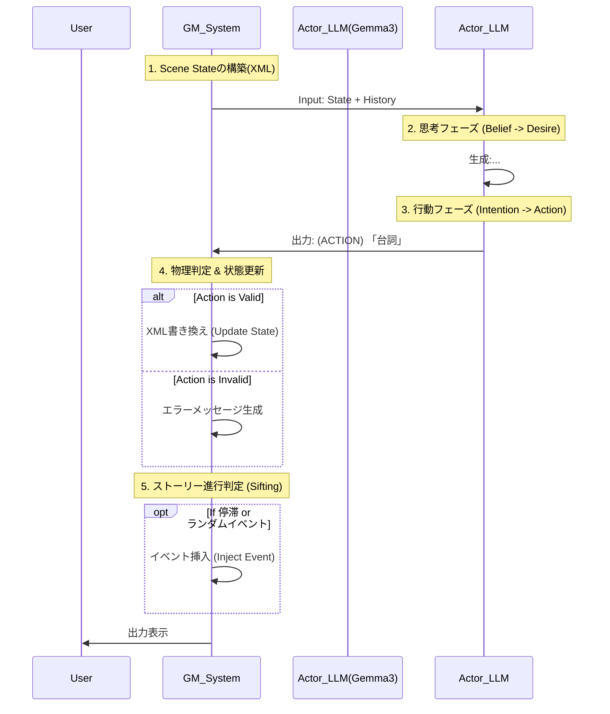
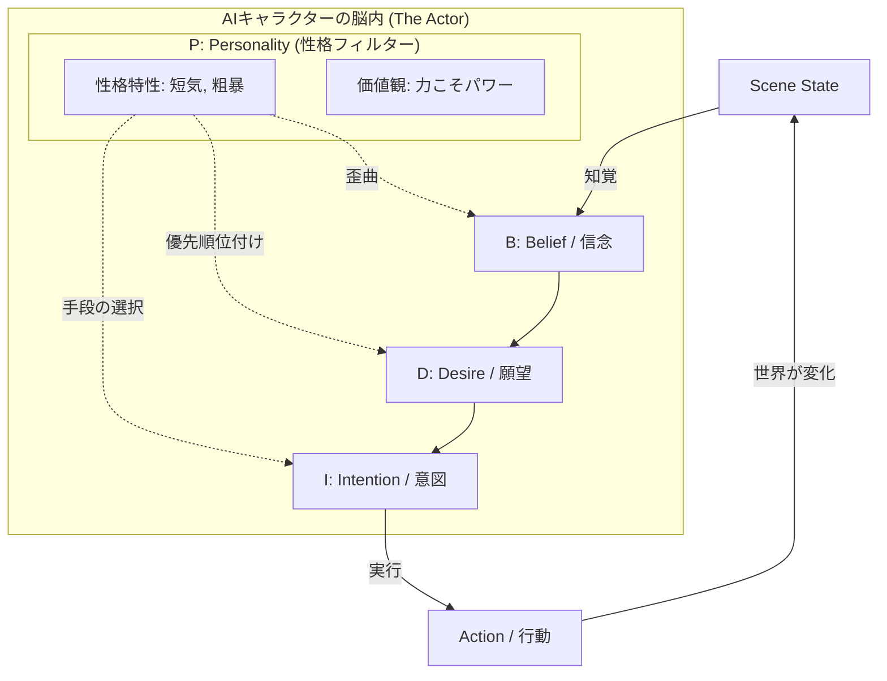
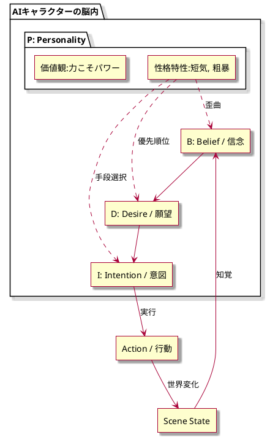

本プロジェクト「箱庭型AIキャラクター対話システム（Miniature Garden Architecture）」の仕様書をまとめます。

これまでの検討に加え、**「Generative Agents（スタンフォード大）」「BDIアーキテクチャ」「ReActプロンプト」**といった先行研究の知見、および前回の「成功の科学（グリット・環境設計）」の概念を、**AIキャラクターの実装仕様として昇華**させました。

---

# 箱庭型AIキャラクター対話システム 設計仕様書

**Project Code:** HAKONIWA-G3
**Target Model:** Google Gemma 3 (Local)

## 1. 設計思想とコアコンセプト

本システムは、テキストチャットの枠を超え、**「環境（Environment）が行動（Behavior）を規定する」**という行動心理学および「Generative Agents」の原則に基づき設計される。

### 1.1 上位概念：環境決定論的エージェント

前回の調査（James Clear『Atomic Habits』等）より、「個人の意志よりも環境デザインが行動を決定する」という知見を採用する。

* **従来:** キャラクターの「性格」だけで会話を生成しようとするため、幻覚（Hallucination）や状況不整合が起きる。
* **本仕様:** **「Scene State（環境）」を厳密に定義し、キャラクターをその制約の中に置く**ことで、一貫性とリアリティを担保する。

### 1.2 アーキテクチャ概要：三層分離モデル

システムを以下の3つの役割に完全に分離し、循環させる。

1. **The Stage (World Model):** 世界の物理法則、オブジェクト、時間を管理する不変のデータ構造（XML/JSON）。
2. **The Actor (Gemma 3 - Character):** 「思考（Thought）」と「演技（Action/Speech）」を行うエージェント。BDIモデルに基づく。
3. **The GM (Rule Engine / Storyteller):** エージェントの行動結果を判定し、Stageの状態を書き換える審判兼演出家。

---

## 2. データ構造仕様 (The Stage)

Gemma 3の強力なXML認識能力を活かし、状態管理はXMLベースで行う。これにより、LLMが「構造化データ」として直感的に理解しやすくなる。

### 2.1 Scene State XML Schema

プロンプトの冒頭に必ず挿入される「世界の真実」。

```xml
<scene_state>
  <meta>
    <location>探偵事務所のデスク</location>
    <time>深夜 02:15</time>
    <weather>激しい雨</weather>
    <tension_level>High</tension_level> </meta>

  <actors>
    <actor id="char_A">
      <name>レイモンド</name>
      <posture>椅子に深く腰掛けている</posture>
      <holding>何も持っていない</holding>
      <status>疲労(Lv.4), 警戒(Lv.2)</status>
    </actor>
  </actors>

  <environment>
    <object id="obj_01" type="prop" state="clickable">
      <name>冷めたコーヒー</name>
      <affordance>飲む, 捨てる, こぼす</affordance>
    </object>
    <object id="obj_02" type="prop" state="locked">
      <name>引き出し</name>
      <affordance>開ける(要:鍵), 叩く</affordance>
    </object>
  </environment>

  <rules>
    <rule>environmentにあるオブジェクト以外は使用禁止</rule>
    <rule>行動は物理的に可能な範囲に限定する</rule>
  </rules>
</scene_state>

```

**仕様のポイント:**

* **Affordance (アフォーダンス):** 各オブジェクトに「何ができるか」を明記する。これにより、LLMが「コーヒーを電話にかける」といった突拍子もない行動を取る確率を下げる。

---

## 3. エージェント実装仕様 (The Actor)

キャラクターAIは、「Story-driven ReAct」パターンを用いて実装する。
心理学的な「成功の要件（グリット、マインドセット）」をパラメータとして組み込む。

### 3.1 BDI+P (Belief, Desire, Intention + Personality) モデル

キャラクターの内部状態を定義するプロンプト変数。

* **Belief (信念):** 現在のScene Stateの認識。「コーヒーは冷めている」「引き出しは開かない」。
* **Desire (願望/目的):** 短期的および長期的なゴール。
* *Short-term:* 「喉を潤したい」
* *Long-term:* 「事件の真相を暴く」


* **Intention (意図):** 具体的な行動計画。「カップを手に取る」。
* **Personality (性格 - Big Five & Grit):**
* **Grit Score (粘り強さ):** 失敗時の挙動を規定。
* *High:* 引き出しが開かなくても、鍵を探す、ピッキングを試みる（諦めない）。
* *Low:* 「開かないか」と言って別の行動に移る。


* **Growth Mindset:** 失敗を「情報収集」と捉えるか、「無能の証明」と捉えるかの独白傾向。


### 3.2 生成パイプライン (2段生成)

**Phase 1: Thought Generation (思考)**

* **Input:** Scene State + 会話履歴 + Desire
* **Prompt指示:** 「Sceneにある情報を元に、Desireを達成するためのIntentionを思考してください。まだ行動はしないでください。」
* **Output:** ` 喉が渇いた。コーヒーがあるが冷めている…まあいい、カフェインが必要だ。`

**Phase 2: Performance (演技)**

* **Input:** Phase 1のThought + Scene State
* **Prompt指示:** 「Thoughtに基づき、Actionタグを使って行動し、台詞を話してください。」
* **Output:** `(GET: 冷めたコーヒー) (DRINK) 「……ひどい味だ」`

---

## 4. GMシステム仕様 (The Game Master)

**Game Master (GM)** は、LLM（論理推論に強いモデル推奨、例: Command R+ や GPT-4o-mini、あるいはルールベース）が担当する。

### 4.1 状態更新ロジック (State Manager)

エージェントが出力した `(Action)` タグを解析し、XMLを書き換える。

* **入力:** `(GET: 冷めたコーヒー)`
* **判定:**
1. 対象 `obj_01` は存在するか？ -> Yes
2. 対象は `clickable` か？ -> Yes
3. Actorの手は空いているか？ -> Yes


* **処理:**
* `obj_01` の `state` を `held_by_char_A` に変更。
* `actors/char_A/holding` を `冷めたコーヒー` に更新。


* **却下時の処理:** 物理的に不可能な場合（鍵がないのに開けようとした等）、GMは ` それはできません` を次のターンの入力として返す。

### 4.2 ナラティブ・シフティング (Story Sifting)

「James Ryan」の研究にある「Story Sifting」の簡易版を実装する。
GMは単に物理計算をするだけでなく、**「物語の停滞」を検知し、介入する。**

* **停滞検知:** 同じ場所での会話がNターン以上続いた場合。
* **介入 (Injection):** 新しいイベントをScene Stateに強制挿入する。
* 例: `<event>突然、電話が鳴り響く</event>` をStateに追加。
* これにより、エージェントは「電話に出る」という新しいDesireを抱かざるを得なくなる（環境による行動の強制）。


---

## 5. 技術スタックとフロー図

### 5.1 推奨構成

* **Local LLM:** Gemma 3 (27B推奨, リソース不足なら 9B-it)
* *Role:* Actor (会話・思考・行動生成)


* **Sub Model / Logic:** Python Script or Small LLM (Gemma 2B / Qwen 2.5 3B)
* *Role:* GM (JSONパース、XML書き換え、ルール判定)


### 5.2 処理ループ (The Loop)



## 6. 先行事例からの差別化・強み

| 概念 | 既存のチャットボット | 本システム (Hakoniwa) |
| --- | --- | --- |
| **記憶** | コンテキストウィンドウ頼り | **外部Scene XML**による永続化と物理制約 |
| **行動原理** | ユーザーへの反応のみ | **Desire (目的)** と **Grit (性格特性)** に基づく自律行動 |
| **整合性** | 崩れやすい (幻覚多発) | **アフォーダンス**により、ない物は使えない |
| **展開** | ユーザー待ち | **GMによるイベント介入**で物語が動く |

## 7. 実装に向けたNext Action

1. **プロンプトエンジニアリング:**
* Gemma 3に対し、上記XML Schemaを理解し、`<thought>`タグと`(action)`タグを使い分けるSystem Promptを作成・テストする。


2. **ステートマネージャー(Python)の作成:**
* XMLを受け取り、テキストの差分ではなく「構造化データの更新」を行うスクリプトの実装。


3. **キャラクター定義:**
* Big FiveとGritのパラメータを設定した「探偵」や「助手」などのキャラクターシート作成。


この仕様書に基づき、まずは「最小構成（1ルーム、1キャラ、数個のアイテム）」でのプロトタイプ作成を推奨します。


---

### BDI+P モデル 概念図 (The Cognitive Loop)

この図は、キャラクター内部で情報がどう処理され、行動に変換されるかを表しています。**Personality（性格）がすべてのプロセスの「フィルター（色眼鏡）」として機能している**点に注目してください。





---

### 各要素の解説

#### 1. P: Personality (性格・価値観フィルター)

これがBDIすべての土台となります。単なるラベル（例：「優しい」）ではなく、**B・D・Iの決定プロセスに介入する「係数」や「重み」**として機能します。

* **機能:** 他の3要素（BDI）を「そのキャラらしく」変換する。
* **実装例 (Grit/Big Five):**
* *Openness (開放性)*が高い → 新しい情報（B）を積極的に取り入れる。
* *Agreeableness (協調性)*が低い → 他者の提案（B）を「敵対的」と解釈する。


#### 2. B: Belief (信念・認識)

「世界はどうなっているか」という**主観的な真実**です。Scene State（客観的事実）とは必ずしも一致しません。

* **客観的事実:** 「目の前に強そうな戦士がいる」
* **AのBelief (臆病):** 「勝てない相手がいる（恐怖）」
* **BのBelief (好戦的):** 「倒しがいのある獲物がいる（興奮）」
* **重要性:** キャラクターは「事実」ではなく「Belief」に基づいて行動するため、**勘違いや早とちり**といった人間味のあるドラマが生まれます。

#### 3. D: Desire (願望・動機)

Beliefに基づいて、「今、何をしたいか」という欲求のリストです。通常、複数の欲求が競合します。

* **競合例:** 「腹が減った（生理的欲求）」vs「かっこよく見せたい（社会的欲求）」
* **Pによる解決:**
* *禁欲的なキャラ* → 「空腹を我慢する」を選択。
* *本能的なキャラ* → 「かっこよさなどどうでもいい、食べる」を選択。


#### 4. I: Intention (意図・計画)

選ばれたDesireを達成するための**具体的な行動計画**です。ここで初めて「アクション」が確定します。

* **Desire:** 「あのドアを開けたい」
* **Pによる手段の分岐:**
* *知的なキャラ* → Intention: 「鍵穴の構造を調べる (Investigate)」
* *粗暴なキャラ* → Intention: 「ドアを蹴破る (Attack)」
* *他力本願なキャラ* → Intention: 「誰かを呼ぶ (Call)」


---

### 具体的な処理フロー（実装イメージ）

このモデルをLLM（Gemma 3）にプロンプトとして与える場合、以下のように**「思考の連鎖（Chain of Thought）」**を構造化させます。

**Scenario:** プレイヤーから「この宝箱、君が開けてよ」と言われた。

#### キャラクターA：盗賊（性格：慎重、金に汚い）

1. **[P] 性格:** 慎重、強欲。
2. ** 認識:** プレイヤーは罠を警戒して俺に押し付けようとしているな？ でも中身は欲しい。
3. ** 願望:** 死にたくない(High) > 金が欲しい(Mid) > プレイヤーの指示に従う(Low)。
4. **[I] 意図:** まず罠の有無を徹底的に調べる。安全なら開けて、中身の一部をこっそり隠す。
5. **[Action]:** `(Inspect: 宝箱) 「へへ…旦那、罠があるかもしれませんぜ。俺が見てやりますよ（その隙に中身を…）」`

#### キャラクターB：騎士（性格：勇敢、忠実）

1. **[P] 性格:** 勇敢、忠誠。
2. ** 認識:** 主人（プレイヤー）が私に任せてくれた。信頼に応えねば。
3. ** 願望:** 主人の命令遂行(High) > 安全確保(Mid)。
4. **[I] 意図:** 躊躇なく開ける。もし罠なら体で主を守る。
5. **[Action]:** `(Open: 宝箱) 「御意。我が剣にかけて、必ずや！」`

---

### まとめ：なぜこのモデルが優れているのか？

従来のチャットボットは、**「入力（Speech）」→「出力（Speech）」** の直接変換になりがちで、文脈が変わると簡単にキャラが崩壊します。

BDI+Pモデルは、**「入力」→「解釈(B)・葛藤(D)・決断(I)」→「出力」** というワンクッションを挟むことで、**「状況が変わっても、そのキャラならこう考えるはずだ」という芯の通った挙動**を保証します。

これが、あなたが目指している「箱庭の中で生きているようなキャラクター」を実現するための鍵となります。